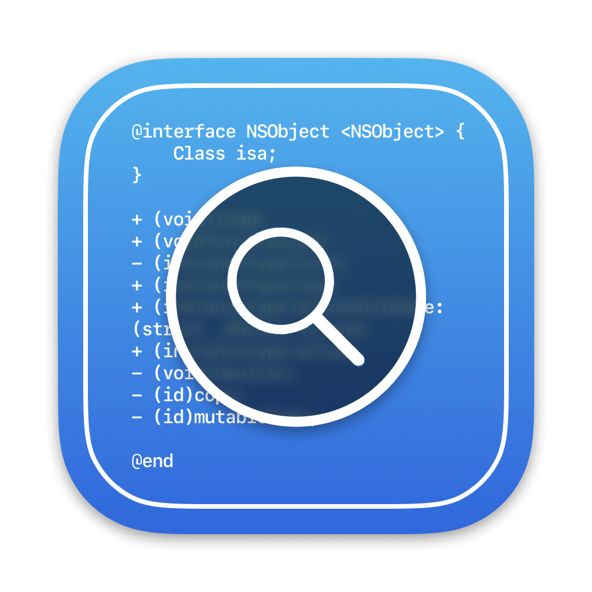
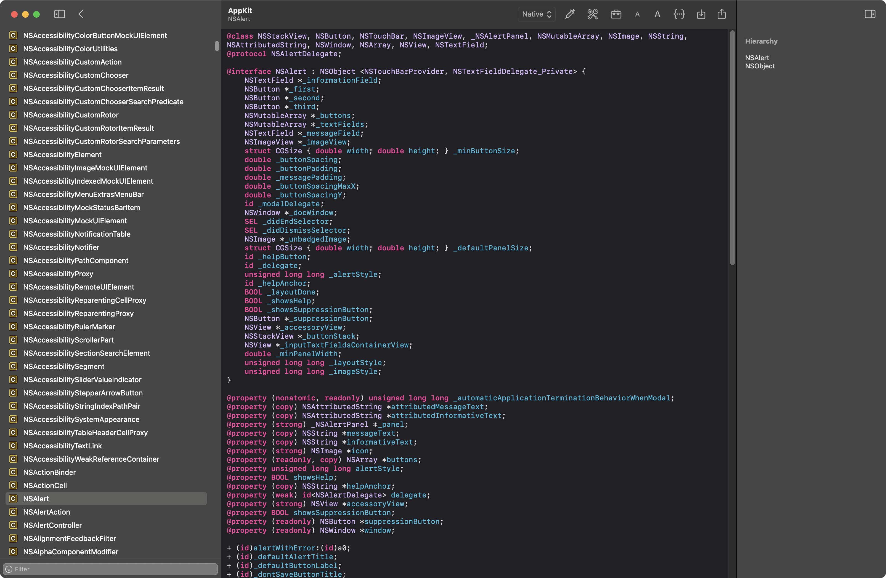
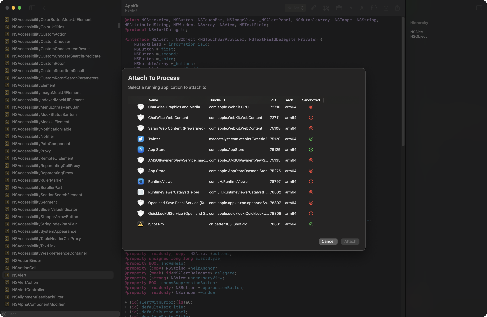
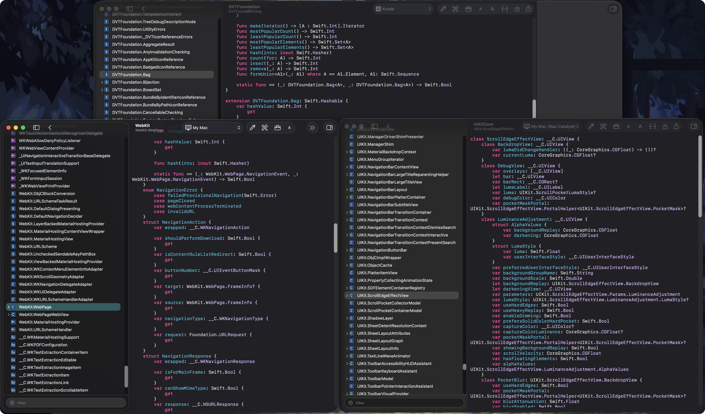

# Runtime Viewer

Alternative to RuntimeBrowser with a more modern UI and more functionality

Powered by 
ObjC:
[ClassDumpRuntime](https://github.com/leptos-null/ClassDumpRuntime)
Swift:
[MachOSwiftSection](https://github.com/MxIris-Reverse-Engineering/MachOSwiftSection)

## Highlights
- Swift Interface support
- Full in AppKit/UIKit, the text view supports type-defined jumps and the exact same highlighting style as Xcode.
- Support `macOS` frameworks and `iOSSupport` frameworks.
- Easy export of header or interface files
- Loading custom macOS frameworks.
- Code Injection (WIP support arm64e) (Needs disable SIP)
- (WIP) Support more iDevice using Bonjour (iOS, watchOS, tvOS, visionOS needs install RuntimeViewerMobileServer framework)

## Usage
The first time you use it you need to install the XPC helper program, this is used to communicate with other apps, click on the icon of the similar tool on the toolbar to install it.

If the Catalyst side and code injection applications do not appear in any directory, try restarting the application.

## Screenshots

