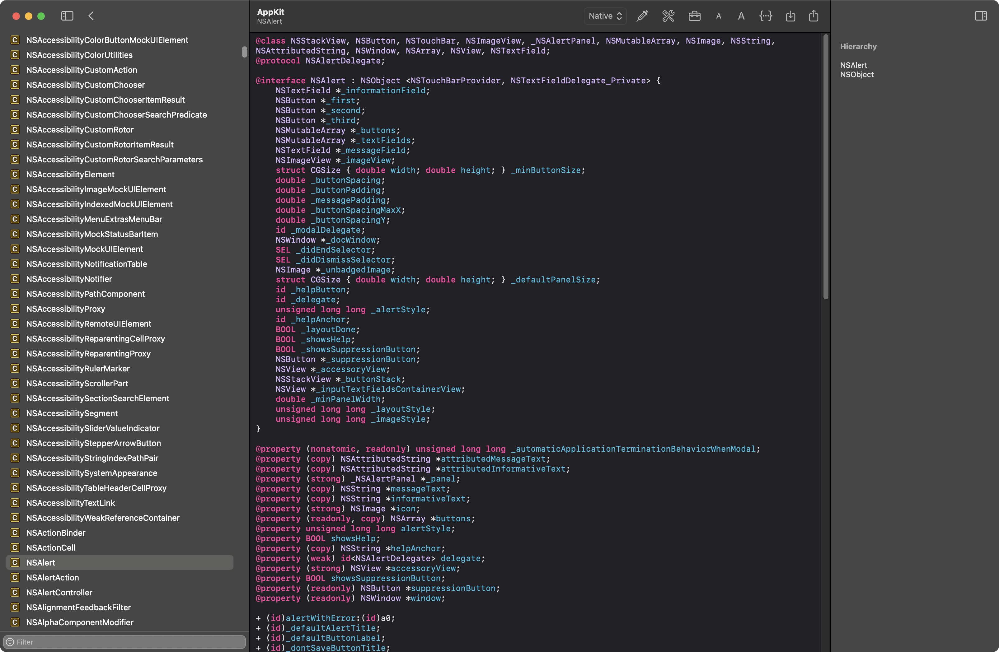
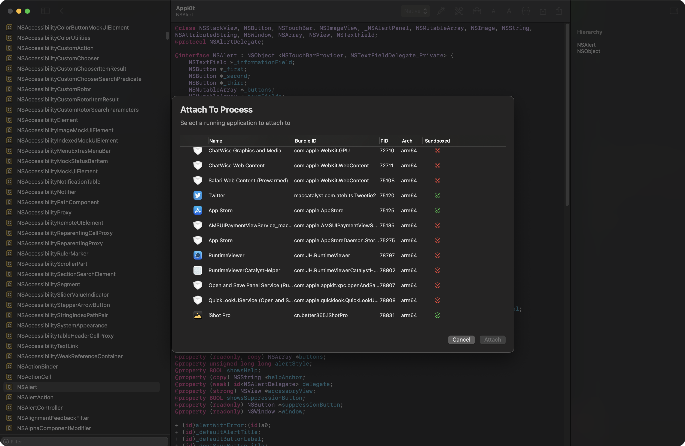

# Runtime Viewer

Alternative to RuntimeBrowser with a more modern UI and more functionality

Powered by [ClassDumpRuntime](https://github.com/leptos-null/ClassDumpRuntime)

## Highlights
- Full in AppKit/UIKit, the text view supports type-defined jumps and the exact same highlighting style as Xcode.
- Support for native frameworks under macOS and frameworks in the iOSSupport directory
- Easy export of header files
- Fast loading of frameworks other than dsc
- Code Injection, view other app objc class headers

## Usage
The first time you use it you need to install the XPC helper program, this is used to communicate with other apps, click on the icon of the similar tool on the toolbar to install it.

If the Catalyst side and code injection applications do not appear in any directory, try restarting the application.

## Screenshots

