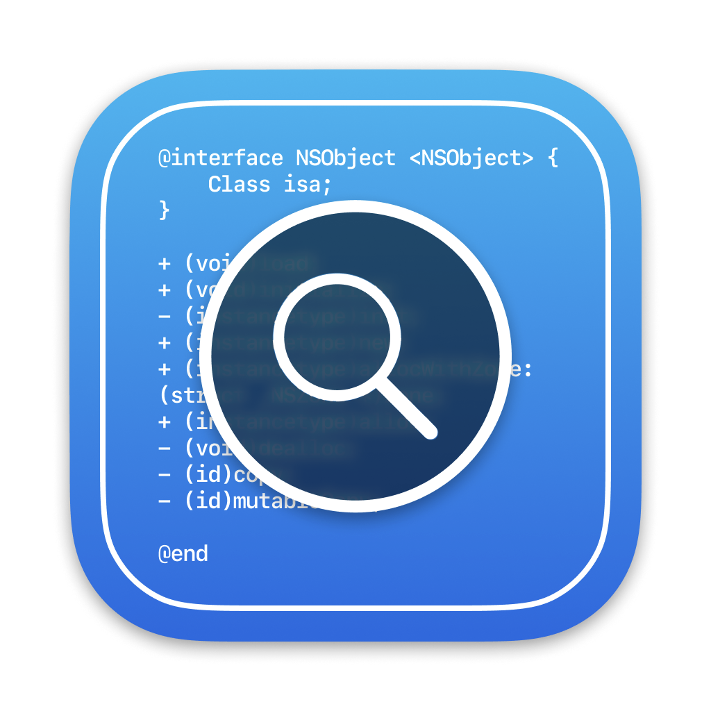
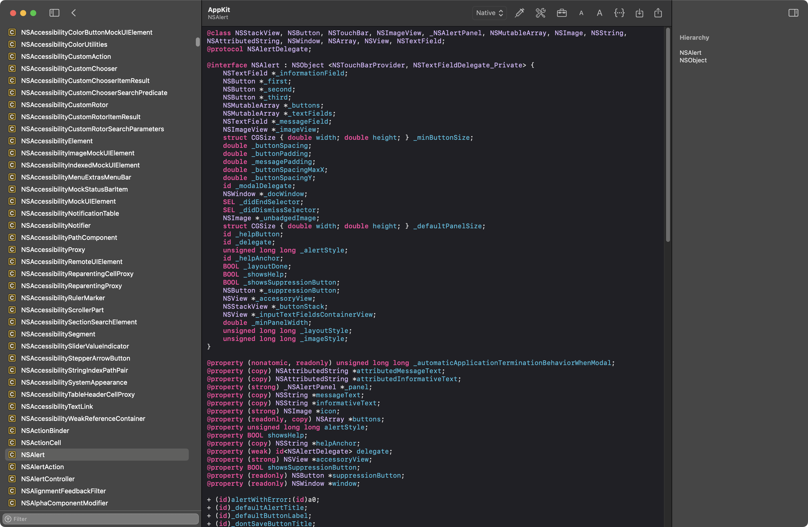
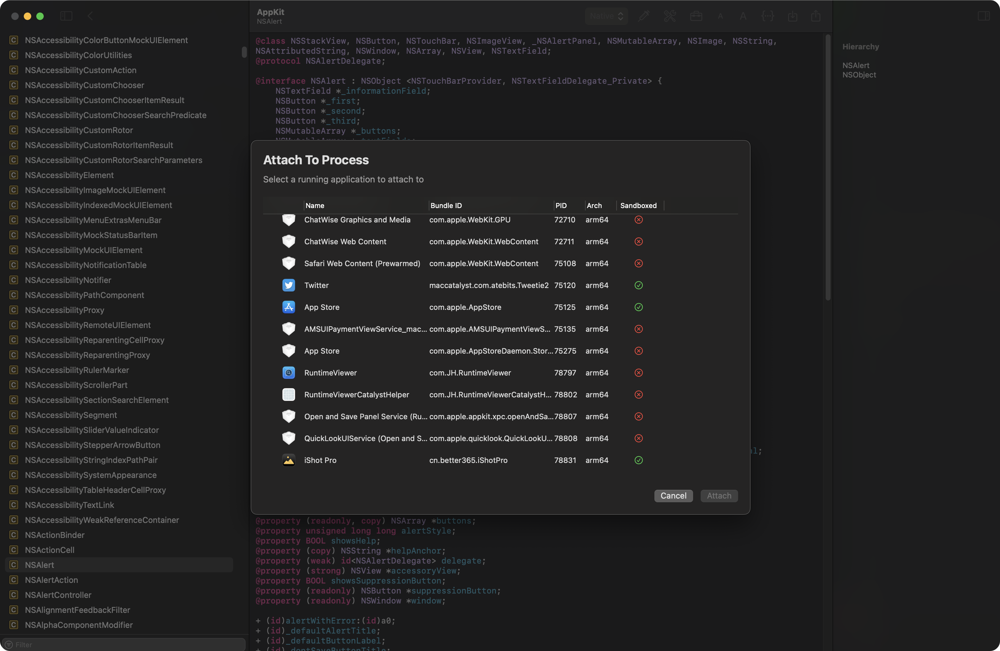
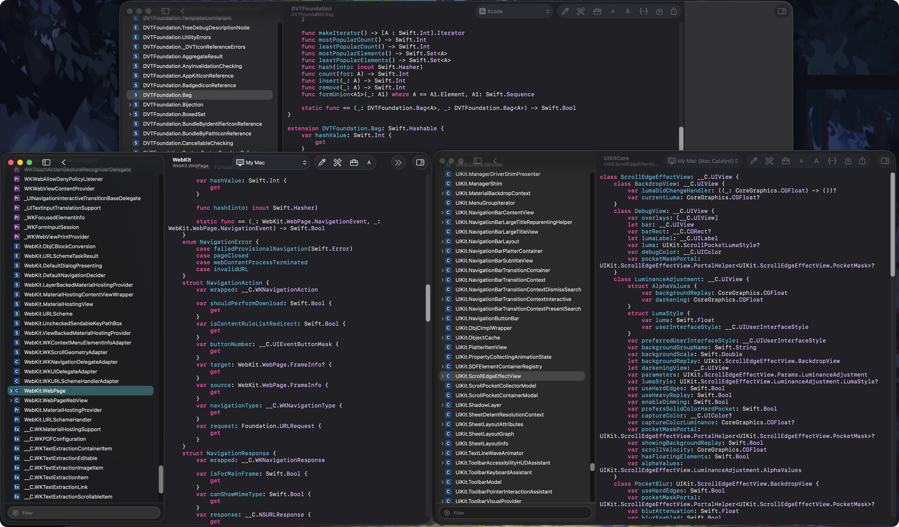

  

<h1 align="center">Runtime Viewer</h1>

  A modern alternative to RuntimeBrowser for inspecting Objective-C and Swift runtime interfaces

## Powered By

| Language    | Library                                                                              | Upstream                                                        |
| ----------- | ------------------------------------------------------------------------------------ | --------------------------------------------------------------- |
| Objective-C | [MachOObjCSection](https://github.com/MxIris-Reverse-Engineering/MachOObjCSection)   | fork of [p-x9/MachOObjCSection](https://github.com/p-x9/MachOObjCSection) |
| Swift       | [MachOSwiftSection](https://github.com/MxIris-Reverse-Engineering/MachOSwiftSection) | —                                                               |
| Mach-O      | [MachOKit](https://github.com/MxIris-Reverse-Engineering/MachOKit)                   | fork of [p-x9/MachOKit](https://github.com/p-x9/MachOKit)       |
| Injection   | [MachInjector](https://github.com/MxIris-Reverse-Engineering/MachInjector)           | —                                                               |

## Highlights

- **Swift & Objective-C Interfaces** – Generate Swift type interfaces (with type/enum layouts and VTable offsets) alongside Objective-C headers directly from Mach-O binaries
- **Xcode-Style Syntax Highlighting** – Full AppKit text view with type-defined jumps and rendering identical to Xcode
- **MCP Integration** *(macOS 15+)* – Let LLM clients (e.g., Claude) inspect runtime information via the Model Context Protocol, with an in-process bridge and a toolbar status indicator
- **Bonjour Multi-Device Mirroring** – Discover and connect to iOS/macOS devices on the local network; remote engines appear in the toolbar's source switcher grouped by host
- **Export Interface Wizard** – Xcode-style multi-step wizard for exporting ObjC/Swift interfaces to single or multiple files
- **Runtime Interface Transformers** – Customizable transformer modules for C type replacement, Swift type/enum layouts, VTable offsets, and member addresses, with reorderable token template presets
- **Code Injection** – Inject into x86_64 and arm64e processes (system apps supported via helper service; requires SIP disabled). Injected processes automatically reconnect across app restarts; sandboxed apps are supported over local TCP sockets
- **Auto-Update** – Sparkle-powered updates with daily checks, manual **Check for Updates…**, EdDSA-signed archives, and an opt-in beta channel for RC / beta builds
- **Framework Support** – Browse `macOS` frameworks, `iOSSupport` frameworks, and load custom Mach-O binaries or frameworks
- **Determinate Loading Progress** – Phase-based progress feedback while indexing Swift and Objective-C sections
- **Filter Engine** – Fuzzy search across runtime classes, protocols, and members
- **Bookmarks** – Reorderable, persisted bookmarks for runtime objects

## Getting Started

### Helper Service Installation

On first launch, register the `SMAppService` helper for inter-process communication and code injection. Open **Settings → Helper Service** and click **Install**. After major updates, Runtime Viewer detects version mismatches and prompts for reinstallation automatically.

### MCP Client Configuration

To expose runtime information to an LLM client:

1. Open **Settings → MCP**
2. Copy the server configuration via the **Copy Config** button
3. Paste it into your LLM client's MCP configuration

The MCP bridge starts automatically on app launch; check the toolbar status indicator to confirm.

### Connecting to Other Devices

Runtime Viewer discovers other instances on the local network via Bonjour. On iOS, allow the local-network permission when prompted. Remote engines appear in the toolbar source switcher grouped by host.

### Updates

Runtime Viewer uses [Sparkle](https://sparkle-project.org/) for automatic updates.

- The app checks for updates once a day by default. You can adjust the interval or disable automatic checks in **Settings → Updates**.
- To try pre-release builds, enable **Settings → Updates → Include pre-release versions (Beta)**. RC and beta builds are delivered through the same feed on an opt-in channel.
- You can always run a manual check from **Runtime Viewer → Check for Updates…**.
- Release feed: `https://mxiris-reverse-engineering.github.io/RuntimeViewer/appcast.xml`.

### Troubleshooting

If Catalyst or code-injected applications don't appear in the directory list, try restarting the application.

## Requirements

- **Main application**: macOS 15+
- **RuntimeViewerCore** (inspection engine): macOS 10.15+, iOS 13+, Mac Catalyst 13+, watchOS 6+, tvOS 13+, visionOS 1+
- **MCP integration**: macOS 15+
- **Build toolchain**: Xcode 26.2+ (Swift 5 language mode)

## Screenshots

