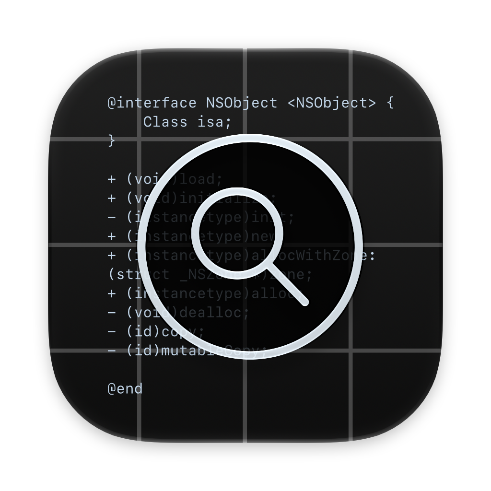
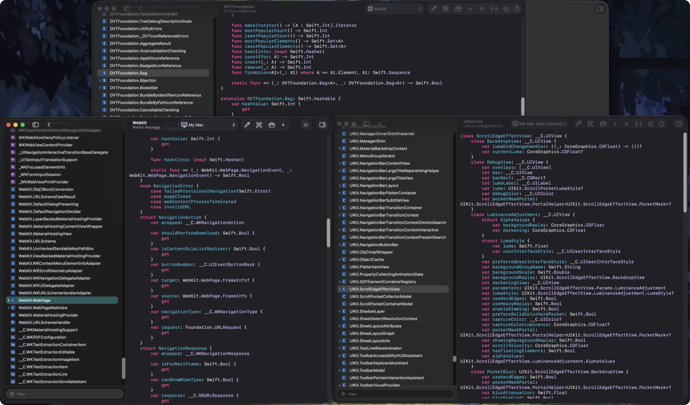
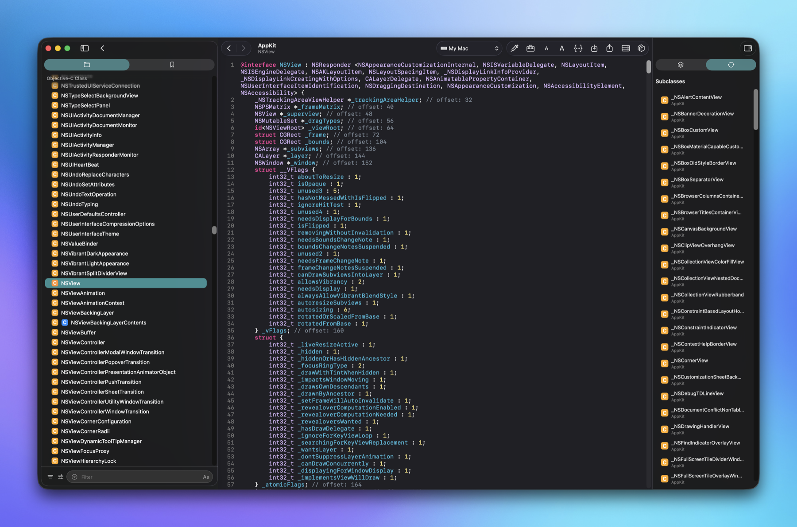
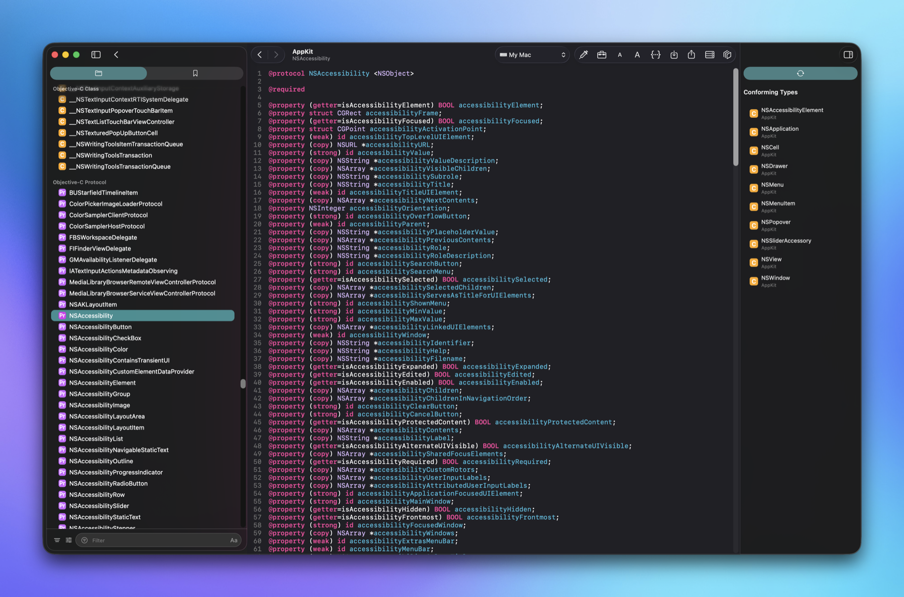
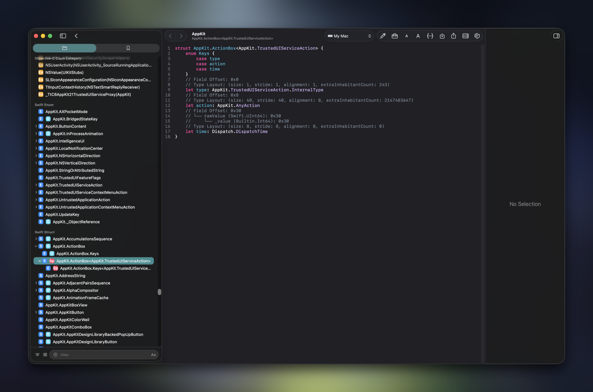
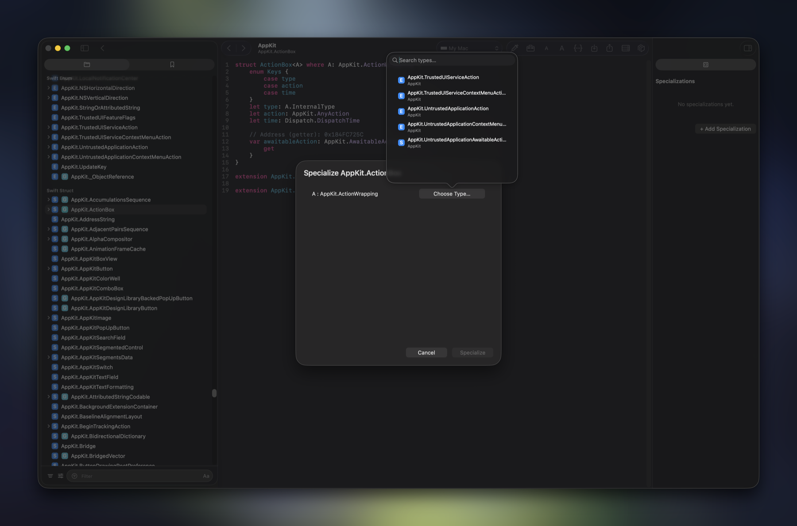
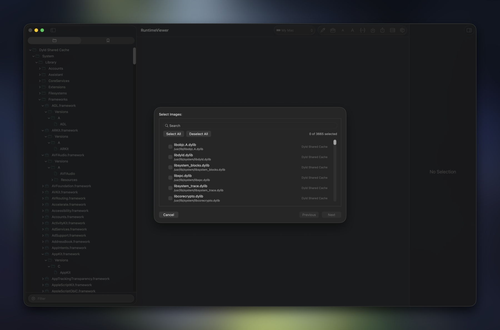
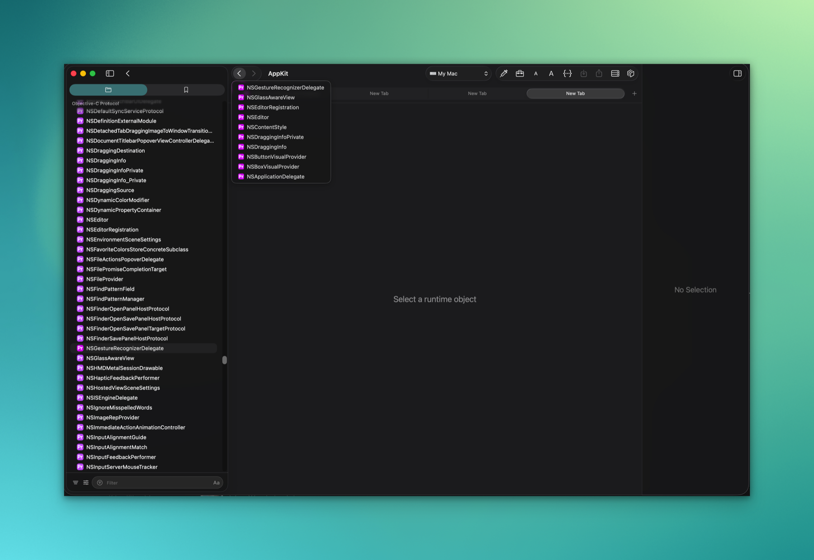

<p align="center">
  
</p>

<h1 align="center">Runtime Viewer</h1>

<p align="center">
  A modern alternative to RuntimeBrowser for inspecting Objective-C and Swift runtime interfaces
</p>

<p align="center">
  <a href="https://github.com/MxIris-Reverse-Engineering/RuntimeViewer/releases/latest"></a>
  
  
  <a href="LICENSE"></a>
</p>

<p align="center">
  
</p>

## Powered By

| Language    | Library                                                                              | Upstream                                                        |
| ----------- | ------------------------------------------------------------------------------------ | --------------------------------------------------------------- |
| Objective-C | [MachOObjCSection](https://github.com/MxIris-Reverse-Engineering/MachOObjCSection)   | fork of [p-x9/MachOObjCSection](https://github.com/p-x9/MachOObjCSection) |
| Swift       | [MachOSwiftSection](https://github.com/MxIris-Reverse-Engineering/MachOSwiftSection) | —                                                               |
| Mach-O      | [MachOKit](https://github.com/MxIris-Reverse-Engineering/MachOKit)                   | fork of [p-x9/MachOKit](https://github.com/p-x9/MachOKit)       |
| Injection   | [MachInjector](https://github.com/MxIris-Reverse-Engineering/MachInjector)           | —                                                               |

## Highlights

- **Swift & Objective-C Interfaces** – Generate Swift type interfaces (with type/enum layouts and VTable offsets) alongside Objective-C headers directly from Mach-O binaries
- **Xcode-Style Syntax Highlighting** – Full AppKit text view with type-defined jumps and rendering identical to Xcode
- **Customizable Color Themes** – Pick a syntax theme in **Settings → Theme**; duplicate the built-in Xcode preset to edit per-token colors (with bold/italic), the editor background, and selection color. Each theme carries light and dark variants that adapt to the system appearance
- **Command Line Interface** – `runtime-viewer-cli` answers the same questions from a terminal or a script without opening a window: list images and types, print interfaces, hierarchies, relationships and member addresses, specialize generics and export whole images, as text or JSON. A background host keeps the indexes warm between calls and exits when idle
- **MCP Integration** *(macOS 15+)* – Let LLM clients (e.g., Claude) inspect runtime information via the Model Context Protocol, with an in-process bridge and a toolbar status indicator
- **Bonjour Multi-Device Mirroring** – Discover and connect to iOS/macOS devices on the local network; remote engines appear in the toolbar's source switcher grouped by host
- **Export Interface Wizard** – Xcode-style multi-step wizard for exporting ObjC/Swift interfaces to single or multiple files
- **Runtime Interface Transformers** – Customizable transformer modules for C type replacement, Swift type/enum layouts, VTable offsets, and member addresses, with reorderable token template presets
- **Code Injection** – Inject into x86_64 and arm64e processes (system apps supported via helper service; requires SIP disabled). Injected processes automatically reconnect across app restarts; sandboxed apps are supported over local TCP sockets
- **Auto-Update** – Sparkle-powered updates with daily checks, manual **Check for Updates…**, EdDSA-signed archives, and an opt-in beta channel for RC / beta builds
- **Framework Support** – Browse `macOS` frameworks, `iOSSupport` frameworks, and load custom Mach-O binaries or frameworks
- **Determinate Loading Progress** – Phase-based progress feedback while indexing Swift and Objective-C sections
- **Filter Engine** – Fuzzy search across runtime classes, protocols, and members
- **Bookmarks** – Reorderable, persisted bookmarks for runtime objects

## Getting Started

### Install Runtime Viewer

Download the macOS release archive from [GitHub Releases](https://github.com/MxIris-Reverse-Engineering/RuntimeViewer/releases/latest), extract it, and move **RuntimeViewer.app** to your Applications folder. GitHub Releases is the official source for prebuilt versions of Runtime Viewer. The project does not publish a Homebrew cask; any such cask is unofficial and unsupported. See [Requirements](#requirements) for supported macOS versions.

### Choose a Runtime Source

Runtime Viewer does not automatically list every application on your Mac. After launching it, choose one of these ways to obtain content:

- Browse the bundled **Local Runtime** source to inspect the local runtime and framework directory.
- Use **Attach Process** in the toolbar to explicitly attach to a running process. Process attachment requires System Integrity Protection (SIP) to be disabled; see [Requirements](#requirements) and [Troubleshooting](#troubleshooting).
- Select another Runtime Viewer instance discovered on your local network. See [Connecting to Other Devices](#connecting-to-other-devices) for Bonjour details.

### Helper Service Installation

To enable inter-process communication and code injection, register the `SMAppService` helper from **Settings → Helper Service** by clicking **Install**. Installing the helper does not install the main app or automatically create connection targets. After major updates, Runtime Viewer detects version mismatches and prompts for reinstallation automatically.

### MCP Client Configuration

To expose runtime information to an LLM client:

1. Open **Settings → MCP**
2. Copy the server configuration via the **Copy Config** button
3. Paste it into your LLM client's MCP configuration

The MCP bridge starts automatically on app launch; check the toolbar status indicator to confirm.

### Command Line Interface

Build the tool from the `RuntimeViewerCommandLine` package and point it at a type:

```bash
cd RuntimeViewerCommandLine
swift build -c release --product runtime-viewer-cli
.build/release/runtime-viewer-cli interface NSView --image AppKit
.build/release/runtime-viewer-cli types --image Foundation --kind objc-class --json
.build/release/runtime-viewer-cli export AppKit --output ~/Desktop/AppKit-Interfaces
```

The first call starts a background host that owns the runtime engine; later calls reuse it, and it exits on its own after ten minutes without work (`host status`, `host stop` and `host restart` manage it). This release inspects the local runtime only; attaching to processes and reaching other devices from the command line are planned. Details, contracts and exit codes: [`Documentations/Guides/CommandLineInterface.md`](Documentations/Guides/CommandLineInterface.md).

### Connecting to Other Devices

Runtime Viewer discovers other instances on the local network via Bonjour. On iOS, allow the local-network permission when prompted. Remote engines appear in the toolbar source switcher grouped by host.

### Window Behavior

Closing the last window leaves Runtime Viewer running, and clicking its Dock icon opens a new window. To have the app quit together with its last window instead, enable **Settings → General → Quit After Closing Last Window**.

### Updates

Runtime Viewer uses [Sparkle](https://sparkle-project.org/) for automatic updates.

- The app checks for updates once a day by default. You can adjust the interval or disable automatic checks in **Settings → Updates**.
- To try pre-release builds, enable **Settings → Updates → Include pre-release versions (Beta)**. RC and beta builds are delivered through the same feed on an opt-in channel.
- You can always run a manual check from **Runtime Viewer → Check for Updates…**.
- Release feed: `https://mxiris-reverse-engineering.github.io/RuntimeViewer/appcast.xml`.

### Troubleshooting

If Catalyst or code-injected applications don't appear in the directory list, try restarting the application.

## Requirements

- **Main application**: macOS 15+
- **Process attachment**: System Integrity Protection (SIP) disabled
- **RuntimeViewerCore** (inspection engine): macOS 10.15+, iOS 13+, Mac Catalyst 13+, watchOS 6+, tvOS 13+, visionOS 1+
- **MCP integration**: macOS 15+
- **Build toolchain**: Xcode 26.2+ (Swift 5 language mode)

## Screenshots

<table>
  <tr>
    <td width="50%" valign="top">
      
      <p><b>Objective-C Interfaces</b><br>Headers reconstructed straight from Mach-O, annotated with ivar offsets and IMP addresses. The inspector lists every subclass found in the image.</p>
    </td>
    <td width="50%" valign="top">
      
      <p><b>Protocols &amp; Conforming Types</b><br>Browse protocol declarations with their required and optional members, and jump to every type that conforms to them.</p>
    </td>
  </tr>
  <tr>
    <td width="50%" valign="top">
      
      <p><b>Swift Interfaces &amp; Type Layout</b><br>Swift types come with size, stride, alignment, extra inhabitant counts, and per-field offsets rendered inline as comments.</p>
    </td>
    <td width="50%" valign="top">
      
      <p><b>Generic Specialization</b><br>Bind concrete types to generic parameters through a searchable picker that respects the parameter's protocol constraints.</p>
    </td>
  </tr>
  <tr>
    <td width="50%" valign="top">
      
      <p><b>Dyld Shared Cache &amp; Export</b><br>Browse the shared cache as a file tree, then export interfaces for any subset of its 3,000+ images through the multi-step wizard.</p>
    </td>
    <td width="50%" valign="top">
      
      <p><b>Tabs &amp; Navigation History</b><br>Open runtime objects in tabs and retrace your path with Xcode-style back/forward navigation history.</p>
    </td>
  </tr>
</table>
